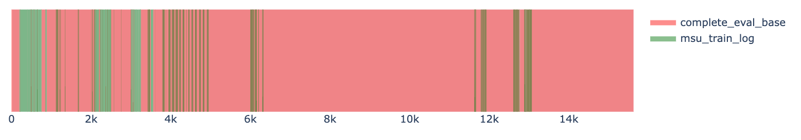

# RobustNASBench Issues

## Hypothesis: There are some issues in the training stage

1. There are many models in MSU with small best_epoches for the best model.

    The best_epoch distribution:

    SUSTech:
    
   
    MSU:
    

3. By comparing the metric of the same model (arch_id ~6000, #nums=169), models trained from SUSTech have better performance. 

    
    
    
    

    And the training curves are different: MSU models suffer more Robust Overfitting.

    Arch_6006 training curves:
    

    Arch_6028 training curves:
    

    Arch_6033 training curves:
                         

    Arch_6118 training curves:
    

    Arch_6327 training curves:
    

Potential Reasons: 

- Different lr (different lr decay rate) or Different PGD attack hyperparams at the training stage?
  - The SUSTech training code is checked: it is as same as the Github code.
  - We also found that some initially trained models in SUSTech (around Mar 2023) are also in the "vertical line" area. The training code at that time could be the same as the MSU code.
  - 

- Different GPU: the training code enables optimized cuda operations by `torch.backends.cudnn.benchmark = True`
  - **Unlikely**. We found that MSU models with different GPUs during training have low accuracy.
  - 
  
## Conclusion

There are some differences in the training stage that cause the low-accuracy "vertical line" areas. We need to check whether there is any code difference between the MSU and Github to confirm the statement.

# Missing *Base Attack* Evaluation

The data is from the GitHub repo.

Red: models that complete *Base Attack* evaluation

Green: models trained by MSU according to the git author of train_log (`arch_xxx.log`)

- Overlapped Green: MSU models that complete *Base Attack* evaluation.
- Nonoverlapping Green (Light Green): MSU models that have not completed *Base Attack* evaluation (missing `arch_xxx_eval_Linf_Base.log`).

Detailed arch_id: [msu_incomplete_base.txt](./msu_incomplete_base.txt)
